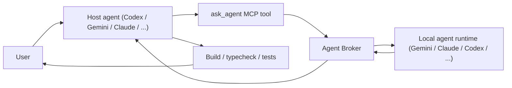

# Agent Broker

<p align="center">Let one local AI agent consult another through a single MCP broker.</p>

<p align="center">
  <a href="https://github.com/stoyanco/agent-broker/actions/workflows/ci.yml"></a>
  <a href="./LICENSE"></a>
</p>

`agent-broker` is a local stdio MCP broker server that lets one agent runtime consult other local agent runtimes through provider adapters. Gemini CLI, Claude Code, and Codex are currently implemented runtimes, and the broker can be used from Codex CLI, Codex app, Gemini CLI, or any other MCP-capable host.

The core idea is simple:

- the user talks to one host agent
- the host agent remains the primary orchestrator
- brokered agent runtimes are used behind the scenes for consultation, review, patch generation, or selective rewrites

This project is intentionally local-first. The broker launches the selected runtime on demand, constrains which files can be read, validates what the runtime returns, and optionally applies validated changes back to disk.

## Project shape

This is not a general-purpose chat wrapper around any single provider.

This is a host-agent-facing tool for cross-model workflows such as:

- asking another agent runtime for a second opinion before changing code
- requesting a review-style pass focused on risks and regressions
- generating a patch for targeted edits
- falling back to full-file rewrites only when patch output is too brittle

The current direction is `patch-first`:

- `mode: "consult"` returns advice or tradeoff analysis
- `mode: "review"` returns findings and risks
- `mode: "patch"` prefers unified diffs in `patches`
- `mode: "rewrite"` returns full file contents in `files`

The host agent can decide when another runtime is useful. The broker is not restricted to UI-only work, although Gemini can be especially helpful for UI polish and alternative implementation ideas.

## Why this exists

AI systems make different mistakes.

Sometimes the best workflow is not to rely on a single model, but to let one local agent consult another provider for:

- cross-checking
- alternative approaches
- patch proposals
- higher-confidence review passes on tricky edits

This broker gives the active host agent a controlled way to do that, starting with Gemini CLI, Claude Code, and Codex.

## Why use this instead of direct provider chat

This project is for cases where you do not want a second model acting as the primary agent.

The host agent stays in charge of:

- deciding when a second opinion is useful
- choosing which files are visible to the delegated runtime
- validating returned outputs before anything touches disk
- running build, typecheck, tests, and integration repair after the delegated runtime responds

That gives you a narrower and more auditable workflow than handing the full session over to another model directly.

## How it works

1. The developer installs at least one supported local runtime, such as Gemini CLI, Claude Code, or Codex CLI.
2. The developer authenticates the chosen runtime locally once.
3. The host agent calls this MCP server through `ask_agent`.
4. The broker reads only the requested safe files from disk.
5. The broker launches the selected runtime locally with adapter-specific process handling. Gemini uses an isolated provider profile by default.
6. The runtime returns structured JSON with `response`, `patches`, and/or `files`. For Gemini CLI, the broker also attempts a one-shot repair pass if the first reply comes back as plain text instead of the expected schema.
7. The broker validates the targets and can optionally apply them.
8. The host agent verifies the result with build, typecheck, tests, or other checks.

The user never talks directly to the brokered runtime in this architecture. The user sees only the current host agent.



## Tool contract

Start request:

```json
{
  "agent": "gemini",
  "model": "gemini-3.1-pro-preview",
  "task": "Review this refactor and point out the riskiest edge cases.",
  "project_root": "C:/path/to/repo",
  "files": ["src/app.ts", "src/routes.ts"],
  "constraints": ["focus on regressions", "do not invent missing context"],
  "mode": "review",
  "apply": false,
  "apply_approved": false,
  "conversation_mode": "continue",
  "conversation_id": "ui-review-thread"
}
```

Poll request:

```json
{
  "job_id": "7d0c4b1a5e6f9a12"
}
```

Request fields:

- `agent` selects the target runtime, for example `gemini`, `claude`, or `codex`
- `model` is optional and lets the host agent request a specific provider model
- if `model` is omitted, the broker uses that agent's configured `default_model`
- if `model` is present, it must still pass broker policy such as `allowed_models`
- `task` and `project_root` are required for start requests
- `files`, `constraints`, `apply`, and `apply_approved` are optional
- `conversation_mode` can be `stateless`, `new`, or `continue`
- `conversation_id` is used only for resumable conversations
- `job_id` is used only for polling and must not be mixed with start fields

Conversation rules:

- `stateless` means no broker-owned session is used
- `new` starts a resumable conversation; if `conversation_id` is omitted, the broker can mint one
- `continue` resumes an existing broker-owned conversation and requires `conversation_id`
- when resuming, the conversation stays pinned to the stored `agent`, `project_root`, and `model`

Output:

```json
{
  "agent": "gemini",
  "model": "gemini-3.1-pro-preview",
  "summary": "Flagged two likely regression points.",
  "response": "The main risk is ...",
  "patches": [],
  "files": {},
  "notes": [],
  "warnings": [],
  "applied": false,
  "applied_files": [],
  "status": "completed",
  "job_id": "7d0c4b1a5e6f9a12",
  "retry_after_ms": 5000
}
```

Patch example:

```json
{
  "agent": "gemini",
  "model": "gemini-3.1-pro-preview",
  "summary": "Prepared a patch for the settings page.",
  "response": "",
  "patches": [
    {
      "path": "src/pages/Settings.tsx",
      "unified_diff": "@@ -1,5 +1,5 @@\n ..."
    }
  ],
  "files": {},
  "notes": ["Business logic unchanged."],
  "warnings": [],
  "applied": false,
  "applied_files": [],
  "status": "completed",
  "job_id": "7d0c4b1a5e6f9a12",
  "retry_after_ms": 5000
}
```

If a request runs longer than the initial wait window, the tool returns `status: "running"` plus a `job_id`. Poll again with `job_id`.

## Typical workflow

1. The host agent identifies a narrow subproblem that would benefit from a second model.
2. The host agent calls `ask_agent` with a constrained task, target `agent`, project root, and explicit file list.
3. The broker validates file access, launches the selected runtime locally, and normalizes the response.
4. The host agent reviews the result and decides whether to apply, adapt, or ignore it.
5. The host agent verifies the outcome with local checks before reporting back to the user.

## Safety model

- Requires an absolute `project_root`
- Blocks path traversal
- Blocks `.env`, lockfiles, build outputs, `node_modules`, and `.git`
- Restricts edits to requested files only
- Supports only text-like source, config, docs, and script files
- Rejects requests over `120000` combined prompt characters
- Keeps Gemini in an isolated profile unless explicitly disabled

## Local commands

```bash
npm install
npm run build
npm run typecheck
npm test
npm run pack:check
npm run smoke:agent
npm start
npm run register:codex
```

## Usage examples

Consult example:

```json
{
  "agent": "gemini",
  "task": "Compare two implementation directions for a file watcher refactor.",
  "project_root": "C:/path/to/repo",
  "files": ["src/watcher.ts"],
  "constraints": ["focus on reliability", "tone: concise"],
  "mode": "consult",
  "apply": false,
  "conversation_mode": "stateless"
}
```

Review example:

```json
{
  "agent": "gemini",
  "task": "Review this change for regressions, Windows path bugs, and missing validation.",
  "project_root": "C:/path/to/repo",
  "files": ["src/server.ts", "src/bridge.ts"],
  "constraints": ["focus on concrete findings only"],
  "mode": "review",
  "apply": false,
  "conversation_mode": "stateless"
}
```

Patch example:

```json
{
  "agent": "gemini",
  "task": "Tighten the settings card spacing while keeping the existing behavior unchanged.",
  "project_root": "C:/path/to/repo",
  "files": ["src/pages/Settings.tsx"],
  "constraints": ["tailwind only", "preserve copy: Settings"],
  "mode": "patch",
  "apply": false,
  "conversation_mode": "stateless"
}
```

## Development workflow

The default contributor loop is:

```bash
npm install
npm run build
npm run typecheck
npm test
npm run pack:check
```

GitHub Actions runs the same verification on pushes to `main` and on pull requests.

For a real local broker path check, run:

```bash
npm run smoke:agent
```

That smoke path stays local-only. It is not part of hosted CI and assumes a working local runtime plus completed local authentication where required. By default it uses the first enabled runtime in this preference order: `codex`, `gemini`, `claude`. Set `SMOKE_AGENT=gemini`, `SMOKE_AGENT=claude`, or `SMOKE_AGENT=codex` to force a specific adapter. The script also preflights the selected adapter against broker policy, so it fails early if the agent is disabled or the current workspace falls outside `allowed_project_roots`.

## Contributing

See [CONTRIBUTING.md](./CONTRIBUTING.md) for contribution scope, PR expectations, and local development guidelines.

## Code of conduct

See [CODE_OF_CONDUCT.md](./CODE_OF_CONDUCT.md).

## Security

See [SECURITY.md](./SECURITY.md) for security reporting guidance. Please avoid opening public issues for sensitive vulnerabilities.

## Troubleshooting

If `gemini` is not installed:

- install the local Gemini CLI first
- or point `GEMINI_BIN` at a custom executable path

If `claude` or `codex` is not installed:

- install the matching local CLI first
- or point `CLAUDE_BIN` / `CODEX_BIN` at a custom executable path

If Gemini auth is missing:

- complete local Gemini authentication outside this repo first
- then rerun `npm run smoke:agent`

If Gemini returns prose instead of the expected broker schema:

- the broker will attempt one repair pass to reformat that reply into the required JSON object
- if repair still fails, the broker falls back to a normalized plain-text response instead of crashing

If Claude or Codex auth is missing:

- complete the matching local authentication flow outside this repo first
- rerun `npm run smoke:agent` or force a different adapter with `SMOKE_AGENT=...`

If requests return `status: "running"`:

- poll again with the returned `job_id`
- increase `AGENT_BROKER_INITIAL_WAIT_MS` or `AGENT_BROKER_POLL_WAIT_MS` if you want fewer immediate `running` responses during local testing

If requests time out:

- raise `GEMINI_BRIDGE_TIMEOUT_MS`
- or raise `CLAUDE_BRIDGE_TIMEOUT_MS` / `CODEX_BRIDGE_TIMEOUT_MS` for those adapters
- confirm the local runtime itself can answer from the same machine

If Windows launching behaves differently:

- prefer leaving command discovery to the bridge or set `GEMINI_BIN` explicitly
- the broker handles `.cmd` wrappers and terminates the spawned process tree on timeout

## Support stance

- Windows and Ubuntu are checked in GitHub Actions CI.
- Live provider validation is local-only by design.
- The public scope remains narrow: brokered second opinions, local runtime orchestration, and patch-first workflows.

## For AI agents

If another AI agent receives only this repository link and needs to bootstrap the project, point it to `AI_SETUP.md`.

## MCP client registration

If you want to register the broker in Codex CLI manually:

```bash
codex mcp add agent-broker -- node C:\absolute\path\to\dist\cli.js
```

Verify in Codex CLI:

```bash
codex mcp list
```

Codex app can use the same local MCP server configuration. The broker is not limited to Codex CLI; it also works from Codex app and other MCP-capable host agents.

The server exposes:

- `ask_agent`
- `list_agents`
- `list_conversations`
- `delete_conversation`

`list_agents` returns both adapter capabilities and active broker policy. The important distinction is:

- `supports_*` fields describe what the adapter/runtime can do in principle
- `allowed_models`, `allowed_project_roots`, `allowed_conversation_modes`, `allowed_modes`, `allow_apply`, `require_apply_approval`, `max_files`, `max_task_chars`, `max_constraints_chars`, `timeout_ms`, and `max_poll_attempts` describe what the broker currently allows after local policy/config is applied

In practice:

- capabilities answer "what this runtime can do"
- policy answers "what this local broker currently permits"

`list_conversations` returns broker-owned resumable sessions with `conversation_id`, `agent`, `project_root`, `model`, `created_at`, and `updated_at`.

`delete_conversation` removes a stored conversation by `conversation_id` and also removes any managed Gemini profile directory tied to that session when Gemini isolation is in use.

## Broker config

The broker can be configured with a local JSON file.

Default path:

- `%USERPROFILE%/.agent-broker/config.json` on Windows
- `~/.agent-broker/config.json` on Unix-like systems

Override path:

- `AGENT_BROKER_CONFIG=/absolute/path/to/config.json`

Example:

```json
{
  "version": 1,
  "conversations": {
    "max_age_hours": 168
  },
  "agents": {
    "gemini": {
      "default_model": "gemini-2.5-flash",
      "allowed_models": ["gemini-2.5-flash", "gemini-3.1-pro-preview"],
      "allowed_project_roots": ["C:/code/frontend", "C:/code/shared"],
      "allowed_conversation_modes": ["stateless", "new", "continue"],
      "allowed_modes": ["consult", "review", "patch", "rewrite"],
      "allow_apply": true,
      "require_apply_approval": true,
      "max_files": 4,
      "max_task_chars": 4000,
      "max_constraints_chars": 600,
      "timeout_ms": 180000,
      "max_poll_attempts": 20
    },
    "claude": {
      "enabled": true,
      "default_model": "sonnet",
      "allowed_models": ["sonnet", "opus"],
      "allowed_project_roots": ["C:/code/frontend"],
      "allowed_conversation_modes": ["stateless", "new", "continue"],
      "allowed_modes": ["consult", "review"],
      "allow_apply": false,
      "require_apply_approval": false,
      "max_files": 2,
      "timeout_ms": 180000
    },
    "codex": {
      "enabled": true,
      "default_model": "gpt-5.4",
      "allowed_models": ["gpt-5.4", "gpt-5.3-codex"],
      "allowed_project_roots": ["C:/code/platform"],
      "allowed_conversation_modes": ["stateless", "new", "continue"],
      "allowed_modes": ["consult", "review"],
      "allow_apply": false,
      "require_apply_approval": false,
      "max_files": 3,
      "max_task_chars": 4000,
      "max_poll_attempts": 10
    }
  }
}
```

If `conversations.max_age_hours` is set, the broker automatically prunes expired resumable sessions based on `updated_at`. Expired sessions disappear from `list_conversations` and can no longer be resumed. Use `max_constraints_chars` when you want to cap prompt-shaping metadata separately from the main `task` body. Use `allowed_project_roots` when an agent should only be callable from specific workspaces or subtrees. Use `require_apply_approval` to force a second explicit signal through `apply_approved=true` before any `apply=true` request is allowed. Use `timeout_ms` and `max_poll_attempts` to put hard runtime and polling bounds on a specific adapter.

## Environment knobs

- `DEBUG=1` enables bridge debug logging to stderr
- `GEMINI_BIN=/path/to/custom/gemini` overrides the CLI executable
- `CLAUDE_BIN=/path/to/custom/claude` overrides the Claude CLI executable
- `CODEX_BIN=/path/to/custom/codex` overrides the Codex CLI executable
- `GEMINI_BRIDGE_MODEL=...` overrides the default Gemini model
- `CLAUDE_BRIDGE_MODEL=...` overrides the default Claude model
- `CODEX_BRIDGE_MODEL=...` overrides the default Codex model
- `GEMINI_BRIDGE_TIMEOUT_MS=300000` overrides the Gemini call timeout
- `CLAUDE_BRIDGE_TIMEOUT_MS=300000` overrides the Claude call timeout
- `CODEX_BRIDGE_TIMEOUT_MS=300000` overrides the Codex call timeout
- `GEMINI_BRIDGE_ISOLATE_PROFILE=0` disables isolated profile mode
- `GEMINI_BRIDGE_PROFILE_HOME=...` overrides the isolated profile home
- `GEMINI_BRIDGE_SOURCE_HOME=...` overrides where OAuth credentials are copied from
- `GEMINI_BRIDGE_APPROVAL_MODE=default|plan|auto_edit|yolo` overrides the bridge approval mode
- `AGENT_BROKER_HOME=...` overrides where broker conversation state is stored
- `AGENT_BROKER_CONFIG=...` overrides the broker config file path
- `AGENT_BROKER_INITIAL_WAIT_MS=15000` controls the initial wait before returning `running`
- `AGENT_BROKER_POLL_WAIT_MS=15000` controls poll wait time for existing jobs
- Legacy `CODEX_COUNCIL_*` env names are still accepted for compatibility
- `LIVE_GEMINI_SMOKE=1 npm test` includes the real Gemini smoke test

## Release policy

See [RELEASE.md](./RELEASE.md) for maintainer release steps and [CHANGELOG.md](./CHANGELOG.md) for release history.

Until the package is published, the repo stays near-publish-ready but keeps `"private": true` in `package.json`.

## Status

The local TypeScript build, typecheck, and automated tests are expected to pass. The repository now reflects the intended shape of the tool: host-agent-neutral, brokered multi-runtime consultation, patch-first where supported, and safe-by-default.

## License

ISC. See `LICENSE`.
